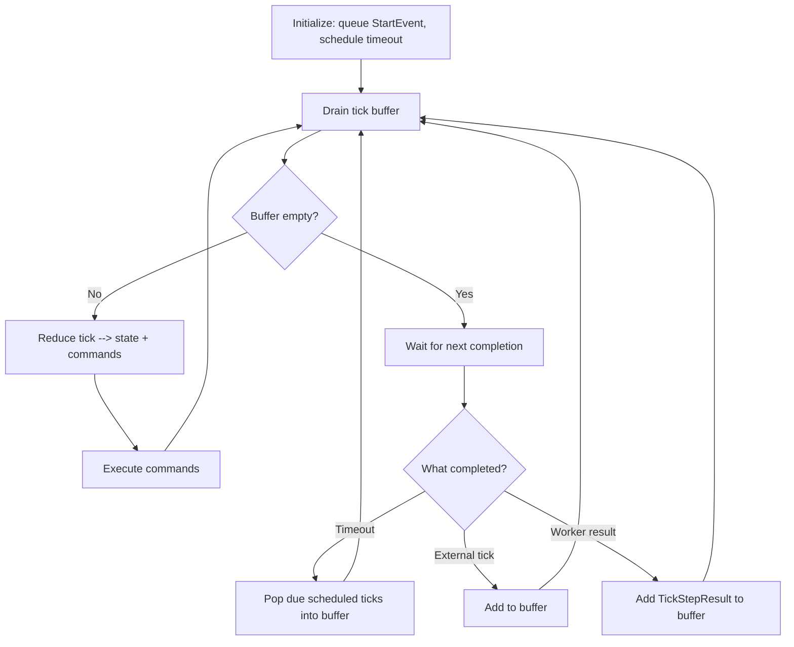
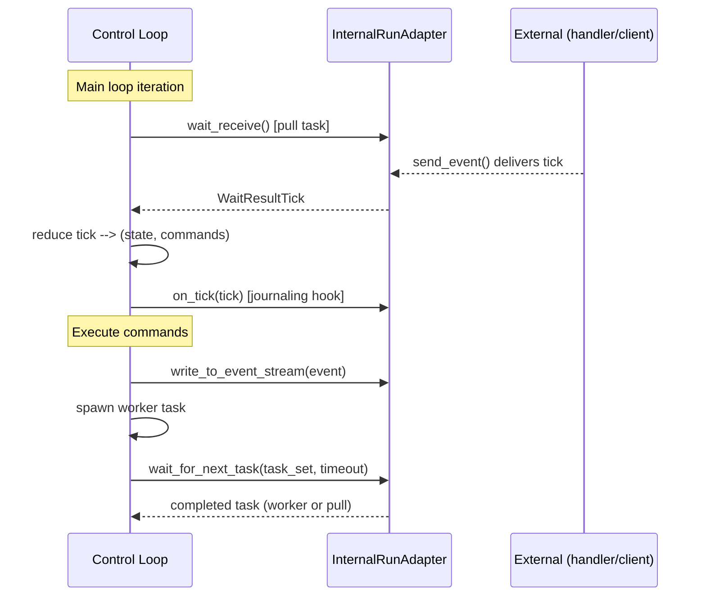

# Control Loop Architecture

The control loop is the core execution engine for workflows. It follows a **reducer pattern** — pure state transitions with side effects expressed as commands:

```
State + Tick --> (NewState, Commands)
```

[`control_loop.py`](../packages/llama-index-workflows/src/workflows/runtime/control_loop.py)

## Main Loop



1. **Initialize** — Queue `StartEvent`, schedule workflow timeout, rewind any in-progress work from a prior run.
2. **Drain tick buffer** — Process all queued ticks synchronously. Each tick runs through the reducer and its commands execute before the next tick.
3. **Wait for next completion** — Build a task set (worker tasks + one pull task), then wait for the first to complete. Workers have priority over pull tasks.
4. **Process completed task** — Route the result back into the tick buffer and loop.

## Ticks and Commands

**Ticks** are inputs to the reducer. They represent things that happen: events arriving, steps completing, cancellation requests, timeouts, and publish requests from steps. Each tick type dispatches to a dedicated reducer function.

[`types/ticks.py`](../packages/llama-index-workflows/src/workflows/runtime/types/ticks.py) — all tick types

**Commands** are outputs from the reducer — the side effects the loop executes. They represent actions to take: spawning step workers, queuing events (with optional delays), completing or failing the run, and publishing events to the external stream.

[`types/commands.py`](../packages/llama-index-workflows/src/workflows/runtime/types/commands.py) — all command types

## Runtime Integration

The control loop is runtime-agnostic. It talks to the outside world exclusively through `InternalRunAdapter` (see [core-overview.md — Runtime and Adapters](./core-overview.md#runtime-and-adapters)). This is the extension point — runtime decorators wrap the adapter to add behavior like tick persistence, idle detection, or event recording.



[`plugin.py`](../packages/llama-index-workflows/src/workflows/runtime/types/plugin.py) — full adapter interface

## Key Design Decisions

- **Deterministic replay** — The reducer is pure. Adapters can record ticks and replay them to reconstruct state, and override time functions for deterministic timestamps.
- **Priority ordering** — Worker tasks complete before pull tasks, ensuring in-flight work finishes before accepting new external events.
- **Optimistic execution with retry** — Workers receive a snapshot of collected events. If new events arrive during execution, the worker re-runs with the updated snapshot.
- **State rehydration** — On resume, in-progress events move back to the queue and worker IDs reset, allowing clean restart from stored ticks.
- **Idle detection** — When all steps are waiting on external input, the loop publishes `WorkflowIdleEvent`. Runtime decorators can use this signal to release idle workflows from memory.
