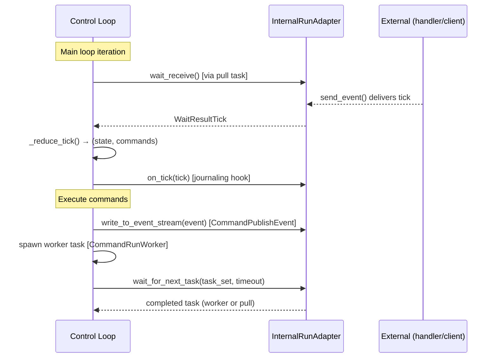

# Control Loop Architecture

The control loop is the core execution engine for workflows. It follows a **reducer pattern** — pure state transitions with side effects expressed as commands:

```
State + Tick → (NewState, Commands)
```

The loop runs inside `_ControlLoopRunner.run()` in [`control_loop.py:272`](../packages/llama-index-workflows/src/workflows/runtime/control_loop.py#L272).

## Main Loop


### Phases

1. **Initialize** (lines 290-311) — Queue `StartEvent`, schedule workflow timeout, rewind any in-progress work from prior run via `rewind_in_progress()`.
2. **Drain tick buffer** (lines 328-332) — Process all queued ticks synchronously. Each tick runs through `_reduce_tick()` and its commands execute before the next tick.
3. **Wait for next completion** (lines 341-361) — Build a task set (worker tasks + one pull task for `wait_receive()`), call `adapter.wait_for_next_task()`. Workers have priority over pull tasks.
4. **Process completed task** (lines 363-406) — Route the result back into the tick buffer and loop.

## Tick Types & Reducers

Each tick type dispatches to a dedicated reducer via `_reduce_tick()` ([line 490](../packages/llama-index-workflows/src/workflows/runtime/control_loop.py#L490)):

| Tick | Reducer | Trigger | Key outputs |
|---|---|---|---|
| `TickAddEvent` | `_process_add_event_tick` (line 824) | Event sent into workflow | `CommandRunWorker`, or enqueue if no capacity |
| `TickStepResult` | `_process_step_result_tick` (line 555) | Step function completed | `CommandQueueEvent`, `CommandCompleteRun`, `CommandFailWorkflow` |
| `TickCancelRun` | `_process_cancel_run_tick` (line 888) | Cancel requested | `CommandHalt` |
| `TickPublishEvent` | `_process_publish_event_tick` (line 899) | Step writes to stream | `CommandPublishEvent` |
| `TickTimeout` | `_process_timeout_tick` (line 906) | Workflow timeout fires | `CommandFailWorkflow` |

## Commands

Commands execute sequentially after each tick reduction in `process_command()` ([line 214](../packages/llama-index-workflows/src/workflows/runtime/control_loop.py#L214)):

| Command | Effect |
|---|---|
| `CommandQueueEvent` | Add `TickAddEvent` to buffer, or schedule with delay |
| `CommandRunWorker` | Spawn async task running the step function |
| `CommandCompleteRun` | Clean up, return `StopEvent` result |
| `CommandHalt` | Clean up, raise cancellation exception |
| `CommandPublishEvent` | Write event to adapter's external stream |
| `CommandFailWorkflow` | Clean up, raise workflow exception |

## Event Routing

When `TickAddEvent` arrives ([`_process_add_event_tick`, line 824](../packages/llama-index-workflows/src/workflows/runtime/control_loop.py#L824)):

1. Find steps whose `accepted_events` includes the event type
2. If step has capacity → assign worker ID, snapshot collected state, emit `CommandRunWorker`
3. If no capacity → append to step's pending queue
4. Check waiters from `ctx.wait_for_event()` and resolve matches
5. Emit `UnhandledEvent` if nothing consumed it

## Runtime Integration

The control loop is runtime-agnostic. It interacts with the outside world exclusively through `InternalRunAdapter` ([`plugin.py:70`](../packages/llama-index-workflows/src/workflows/runtime/types/plugin.py#L70)):



### Adapter methods used by the control loop

| Method | When called | Purpose |
|---|---|---|
| `wait_receive()` | Each iteration, as a pull task (line 342) | Block until an external tick arrives |
| `wait_for_next_task()` | Each iteration (line 359) | Wait for first completed task from the task set. Controls priority ordering |
| `on_tick()` | After each tick reduction (line 431) | Hook for persistence/journaling — DurableDecorator uses this to append ticks to store |
| `write_to_event_stream()` | On `CommandPublishEvent` (line 240) | Push events to external stream (consumed via `handler.stream_events()`) |
| `get_now()` | Throughout (lines 294, 323, 336, 365, etc.) | Current time — overridable for deterministic replay |
| `send_event()` | From step functions via context | Inject ticks back into the mailbox from within the workflow |
| `close()` | On cleanup (line 252) | Wake blocked waits during shutdown |
| `finalize_step()` | After step completion | Adapter-specific cleanup after each step |

### How decorators plug in

The adapter is the extension point. Runtime decorators wrap the adapter to add behavior:

- **BasicRuntime** — `wait_for_next_task` uses `asyncio.wait(FIRST_COMPLETED)`. `get_now()` returns `time.time()`.
- **DurableDecorator** — `on_tick()` persists ticks to store. Detects `WorkflowIdleEvent` to release memory. Rebuilds state from stored ticks on reload.
- **ServerRuntimeDecorator** — Records published events. Tracks handler lifecycle (running/completed/failed).

## Key Design Decisions

- **Deterministic replay** — Adapters can override `wait_for_next_task()` to replay from a journal, and `get_now()` to return memoized timestamps.
- **Priority ordering** — Worker tasks complete before pull tasks in `wait_for_next_task()`, ensuring in-flight work finishes before accepting new events.
- **Optimistic execution with retry** — Workers receive a snapshot of `collected_events`. If new events arrive during execution, the worker re-runs with the updated snapshot ([`AddCollectedEvent` handling, line 680](../packages/llama-index-workflows/src/workflows/runtime/control_loop.py#L680)).
- **State rehydration** — `rewind_in_progress()` ([line 507](../packages/llama-index-workflows/src/workflows/runtime/control_loop.py#L507)) moves in-progress events back to queue on resume, re-assigns worker IDs from 0.
- **Idle detection** — `_check_idle_state()` ([line 536](../packages/llama-index-workflows/src/workflows/runtime/control_loop.py#L536)) detects when all steps are waiting on external input, publishing `WorkflowIdleEvent` for the durable runtime to release memory.
