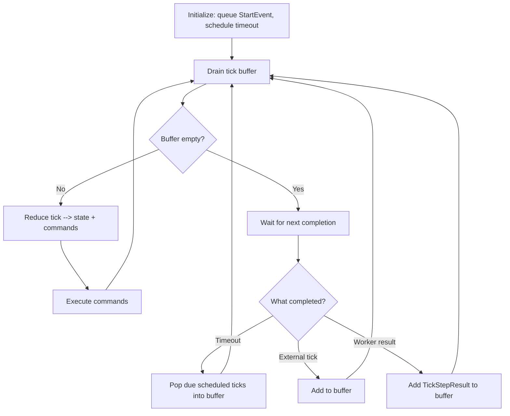
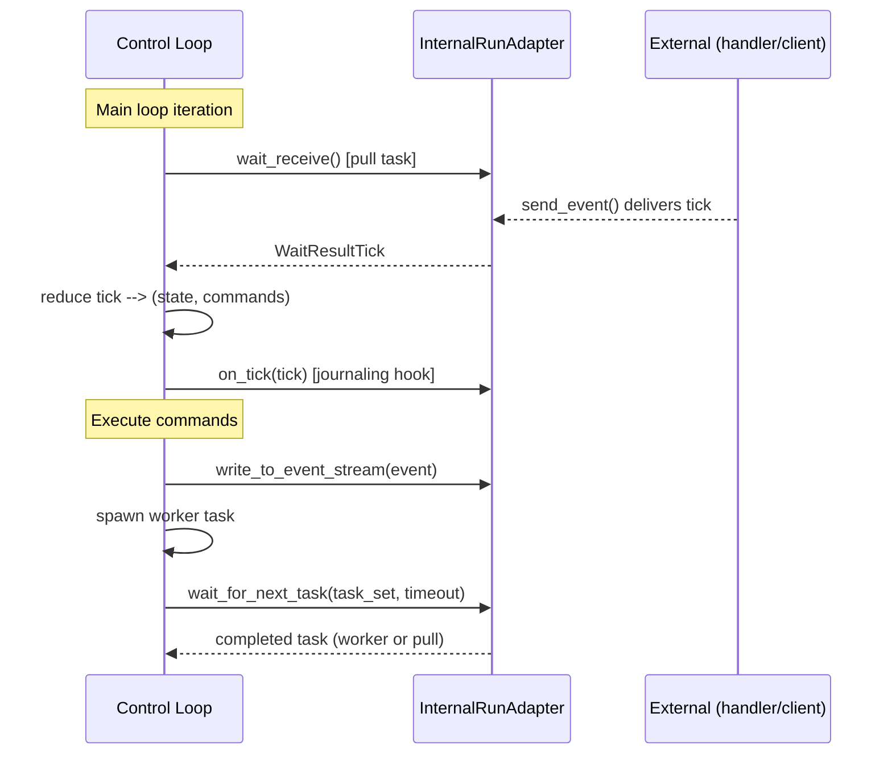

# Control Loop Architecture

The control loop is the core execution engine for workflows. It follows a **reducer pattern** — pure state transitions with side effects expressed as commands:

```
State + Tick --> (NewState, Commands)
```

[`control_loop.py`](../packages/llama-index-workflows/src/workflows/runtime/control_loop.py)

## Main Loop



1. **Initialize** — Queue `StartEvent`, schedule workflow timeout, rewind any in-progress work from a prior run.
2. **Drain tick buffer** — Process all queued ticks synchronously. Each tick runs through the reducer and its commands execute before the next tick.
3. **Wait for next completion** — Build a task set (worker tasks + one pull task for `wait_receive()`), call `adapter.wait_for_next_task()`. Workers have priority over pull tasks.
4. **Process completed task** — Route the result back into the tick buffer and loop.

## Ticks and Commands

**Ticks** are inputs to the reducer. Each type dispatches to a dedicated reducer function:

| Tick | Role |
|---|---|
| `TickAddEvent` | An event entered the workflow — route to accepting steps or queue if at capacity |
| `TickStepResult` | A step function completed — handle its return value (event, StopEvent, failure, retry) |
| `TickCancelRun` | Cancellation requested |
| `TickPublishEvent` | A step wants to publish an event to the external stream |
| `TickTimeout` | Workflow-level timeout fired |

**Commands** are outputs from the reducer — the side effects that the loop executes:

| Command | Role |
|---|---|
| `CommandQueueEvent` | Add a tick to the buffer, or schedule it with a delay |
| `CommandRunWorker` | Spawn an async task running a step function |
| `CommandCompleteRun` | Workflow finished successfully — clean up and return result |
| `CommandHalt` | Workflow cancelled — clean up and raise |
| `CommandPublishEvent` | Push an event to the external stream via the adapter |
| `CommandFailWorkflow` | Workflow failed — clean up and raise |

## Runtime Integration

The control loop is runtime-agnostic. It talks to the outside world exclusively through `InternalRunAdapter` (see [core-overview.md — Runtime and Adapters](./core-overview.md#runtime-and-adapters)):



### Adapter contract

| Method | Role |
|---|---|
| `wait_receive()` | Block until an external tick arrives. Used as the pull task each iteration |
| `wait_for_next_task()` | Wait for the first completed task from a set. Controls priority ordering between workers and pull tasks |
| `on_tick()` | Hook called after each tick reduction — used by DurableDecorator to persist ticks to the store |
| `write_to_event_stream()` | Push events to the external stream — consumed via `handler.stream_events()` |
| `get_now()` | Current time — overridable for deterministic replay |
| `send_event()` | Inject ticks from within step functions back into the control loop |
| `close()` | Wake blocked waits during shutdown |
| `finalize_step()` | Adapter-specific cleanup after each step |

This is the extension point for runtime decorators. Each decorator wraps the adapter to add behavior — see [server-architecture.md — Runtime Decorator Chain](./server-architecture.md#runtime-decorator-chain).

## Key Design Decisions

- **Deterministic replay** — Adapters can override `wait_for_next_task()` to replay from a journal, and `get_now()` to return memoized timestamps. The reducer is pure, so replaying the same ticks reproduces the same state.
- **Priority ordering** — Worker tasks complete before pull tasks in `wait_for_next_task()`, ensuring in-flight work finishes before accepting new external events.
- **Optimistic execution with retry** — Workers receive a snapshot of `collected_events`. If new events arrive during execution, the worker re-runs with the updated snapshot.
- **State rehydration** — `rewind_in_progress()` moves in-progress events back to the queue on resume and re-assigns worker IDs from 0.
- **Idle detection** — When all steps are waiting on external input, the loop publishes `WorkflowIdleEvent`. The [DurableDecorator](./server-architecture.md#components) uses this to release idle workflows from memory.
