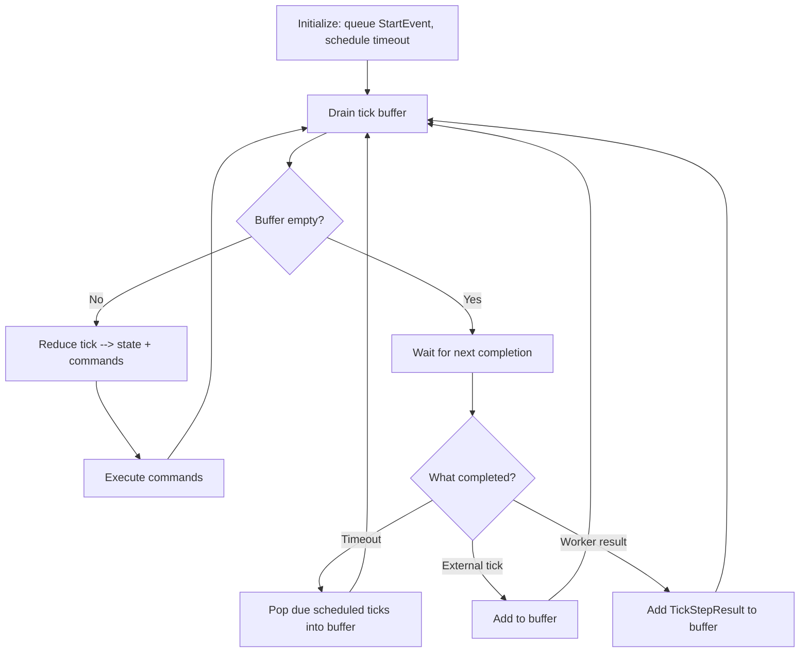
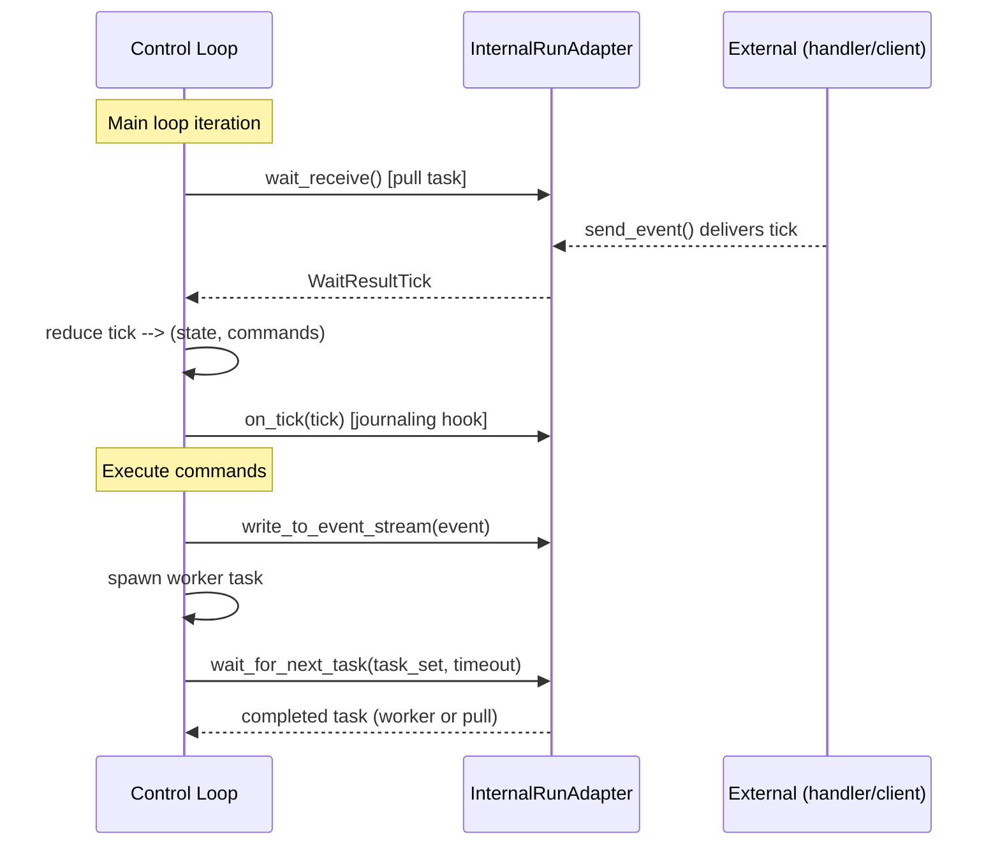

# Control Loop Architecture

The control loop is the core execution engine for workflows. It follows a **reducer pattern** — pure state transitions with side effects expressed as commands:

```
State + Tick --> (NewState, Commands)
```

[`control_loop/`](../packages/llama-index-workflows/src/workflows/runtime/control_loop) — split along the reducer seam into `runner.py` (async runtime: tasks, the wakeup heap, command execution), `reduce.py` (the pure reducer: `_reduce_tick` and the per-tick processors), and `streams.py` (collection-stream accounting). The package `__init__` re-exports the surface so `workflows.runtime.control_loop` stays a single import target.

## Main Loop


```mermaid
flowchart TD
    A[Initialize: queue StartEvent, schedule timeout] --> B[Drain tick buffer]
    B --> C{Buffer empty?}
    C -- No --> D[Reduce tick --> state + commands]
    D --> E[Execute commands]
    E --> B
    C -- Yes --> F[Wait for next completion]
    F --> G{What completed?}
    G -- Timeout --> H[Pop due scheduled ticks into buffer]
    G -- External tick --> I[Add to buffer]
    G -- Worker result --> J[Add TickStepResult to buffer]
    H --> B
    I --> B
    J --> B
```

1. **Initialize** — Queue `StartEvent`, schedule workflow timeout, rewind any in-progress work from a prior run.
2. **Drain tick buffer** — Process all queued ticks synchronously. Each tick runs through the reducer and its commands execute before the next tick.
3. **Wait for next completion** — Build a task set (worker tasks + one pull task), then wait for the first to complete. Workers have priority over pull tasks.
4. **Process completed task** — Route the result back into the tick buffer and loop.

## Ticks and Commands

**Ticks** are inputs to the reducer. They represent things that happen: events arriving, steps completing, cancellation requests, timeouts, and publish requests from steps. Each tick type dispatches to a dedicated reducer function.

[`types/ticks.py`](../packages/llama-index-workflows/src/workflows/runtime/types/ticks.py) — all tick types

**Commands** are outputs from the reducer — the side effects the loop executes. They represent actions to take: spawning step workers, queuing events (with optional delays), completing or failing the run, and publishing events to the external stream.

[`types/commands.py`](../packages/llama-index-workflows/src/workflows/runtime/types/commands.py) — all command types

## Runtime Integration

The control loop is runtime-agnostic. It talks to the outside world exclusively through `InternalRunAdapter` (see [core-overview.md — Runtime and Adapters](./core-overview.md#runtime-and-adapters)). This is the extension point — runtime decorators wrap the adapter to add behavior like tick persistence, idle detection, or event recording.


```mermaid
sequenceDiagram
    participant CL as Control Loop
    participant A as InternalRunAdapter
    participant Ext as External (handler/client)

    Note over CL: Main loop iteration
    CL->>A: wait_receive() [pull task]
    Ext-->>A: send_event() delivers tick
    A-->>CL: WaitResultTick

    CL->>CL: reduce tick --> (state, commands)
    CL->>A: on_tick(tick) [journaling hook]

    Note over CL: Execute commands
    CL->>A: write_to_event_stream(event)
    CL->>CL: spawn worker task

    CL->>A: wait_for_next_task(task_set, timeout)
    A-->>CL: completed task (worker or pull)
```

[`plugin.py`](../packages/llama-index-workflows/src/workflows/runtime/types/plugin.py) — full adapter interface

## Recursive Brokers (Child Workflows)

A child-workflow invocation is **not** a set of namespace-tagged rows in a flat state — it is a nested `BrokerState` reduced by the same reducer. `BrokerState` is self-similar ([`types/internal_state.py`](../packages/llama-index-workflows/src/workflows/runtime/types/internal_state.py)): each broker owns its own `workers`, `streams`, `work_item_seq`, and a `children: dict[str, ChildBroker]` of nested brokers. `BrokerConfig` recurses in lockstep via `child_configs` (a static slot-name → child-class config map), so the pure reducer reaches a child's template at descent without touching `Workflow`. The root is simply the broker whose parent is the runner.

**Addressing.** A tick carries an *invocation path* — a tuple of `"slot#N"` segments, root = `()` — in its `invocation_namespace`/`origin_namespace` field. `_reduce_tick` descends that path to the addressed broker and reduces locally with the exact same functions used for the root; a path that no longer resolves is a dead invocation and publishes a loud `UnhandledEvent`. Step identity within a broker is **local** (bare `StepId((), name)`); published step names re-prepend the static path (`child/run`, never `child#0/run`). `TickWakeup` and idle/stuck detection are global and walk the whole tree in a deterministic sorted order.

**Counter-minted ids.** Invocation ids are deterministic per-slot counters (`child#0`, `child#1`) minted from `child_seq` on the parent broker (persisted in the snapshot). When one event descends into several slots in one tick, minting is in sorted slot-name order — so snapshot-resume and full-journal replay reconstruct identical ids.

**Boundary crossing** is the only place parent and child interact:

- **Descent** — when a parent's local routing finds a child slot whose class accepts a `StartEvent`-typed event, it mints the next `slot#N`, creates the child `BrokerState` from `config.child_configs[slot]`, records the delivering event's stream identity as a *boundary work item* on the `ChildBroker`, and delivers the event into the child on a **fresh empty scope**. For stream accounting the descent counts as **exactly one** work item in the parent's enclosing stream, regardless of how many of the child's start steps accept the event.
- **Ascent (success)** — a step returning its workflow's `StopEvent` completes that broker uniformly. For a child, the parent pops the record (the subtree drops recursively), emits a path-prefixed `CommandCancelNamespace`, consumes the boundary work item once, and re-injects the stop event into its own local routing carrying the boundary scope + recovery lineage. At the root the "parent" is the runner: completion becomes `CommandCompleteRun` + stream publish.
- **Ascent (failure/timeout)** — a child broker whose step fails uncaught locally (no handler, or budget spent), or whose deadline fires uncaught, surfaces to its parent as a boundary *failure* (`_ascend_boundary_failure`): the parent pops the child and routes a `StepFailedEvent` **named for the child's path** through its own wildcard `@catch_error` table with normal `max_recoveries` accounting. A boundary failure/timeout is not attributable to any in-broker step, so **only a parent's wildcard `@catch_error` (no `for_steps`) catches it — a step-scoped handler never does** (`_wildcard_catch_error_handler`). Caught → the boundary work item lives on as the handler invocation (still-live, no stream adjustment). Uncaught → the parent itself becomes the failing boundary to *its* parent, recursing; uncaught at the root fails the run. `CommandHalt` stays reserved for root cancel / root timeout.

**Liveness and sends.** Liveness *is* child-record presence — teardown is popping the record. A step's `ctx.send_event` is broker-local: a targeted send resolves against the sender's own broker (bare step name); addressing another broker is a loud `WorkflowRuntimeError`. External senders address a concrete invocation path (`child#0/answer`); a static child path (`child/answer`) is ambiguous and rejected.

**Elapsed-alive timeout budget.** Every broker (root and each child) may spend `timeout` seconds of *known-alive* time, tracked as `elapsed_alive` on the `BrokerState`. Each stamped tick accrues the gap since the broker's `last_alive_stamp` (the process was alive across it) on every broker on the addressed path; a **session-start marker** (journaled at each `run()`/resume) resets `last_alive_stamp` across the tree *without* accruing, so inter-session downtime is forgiven. A child's deadline arms at descent (and re-arms fresh after it catches its own timeout) at `now + (timeout − elapsed_alive)`; the runner re-arms the root and every live child on resume from the persisted budget. When a deadline fires the reducer accrues to the fire stamp: if the budget is truly spent it expires the broker (root → `CommandHalt` + `WorkflowTimeoutError`; child → boundary failure), otherwise it re-arms for the remainder (a fire made premature by forgiven downtime or a superseded re-arm). Snapshot-resume and full-journal replay reconstruct identical budgets; unstamped legacy journals never accrue.

## Key Design Decisions

- **Deterministic replay** — The reducer is pure. Adapters can record ticks and replay them to reconstruct state, and override time functions for deterministic timestamps.
- **Priority ordering** — Worker tasks complete before pull tasks, ensuring in-flight work finishes before accepting new external events.
- **Optimistic execution with retry** — Workers receive a snapshot of collected events. If new events arrive during execution, the worker re-runs with the updated snapshot.
- **State rehydration** — On resume, in-progress events move back to the queue and worker IDs reset, allowing clean restart from stored ticks.
- **Idle detection** — When all steps are waiting on external input, the loop publishes `WorkflowIdleEvent`. Runtime decorators can use this signal to release idle workflows from memory.
- **Retry-exhaustion hook** — `_schedule_retry_or_route_failure` (the `StepWorkerFailed` path of `_dispatch_step_result`) routes a `StepFailedEvent` to a registered `@catch_error` handler. Handlers can be scoped (`@catch_error(for_steps=[...])`) or wildcard, with a per-handler `max_recoveries` budget tracked per event lineage in `recovery_counts: dict[str, int]` on `EventAttempt` / `TickAddEvent` / `CommandQueueEvent`. Routing consults `BrokerConfig.handler_for_step` and `BrokerConfig.catch_error_handlers`; when the count exceeds `max_recoveries` or no handler owns the step, the loop publishes a `WorkflowFailedEvent` carrying the live exception and fails the run. The live `Exception` rides on `EventAttempt` / `TickAddEvent` / `CommandQueueEvent` between retries — annotated with `SerializableException` where it crosses a pydantic serialization boundary — and is exposed to step bodies via `Context.retry_info()`.
