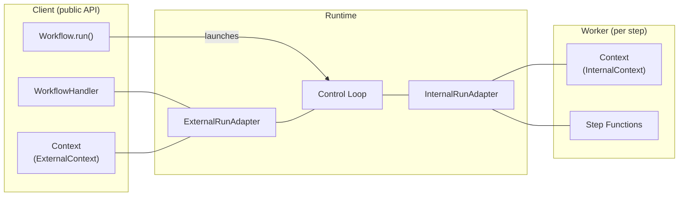
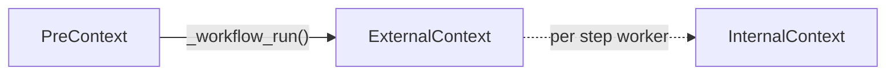
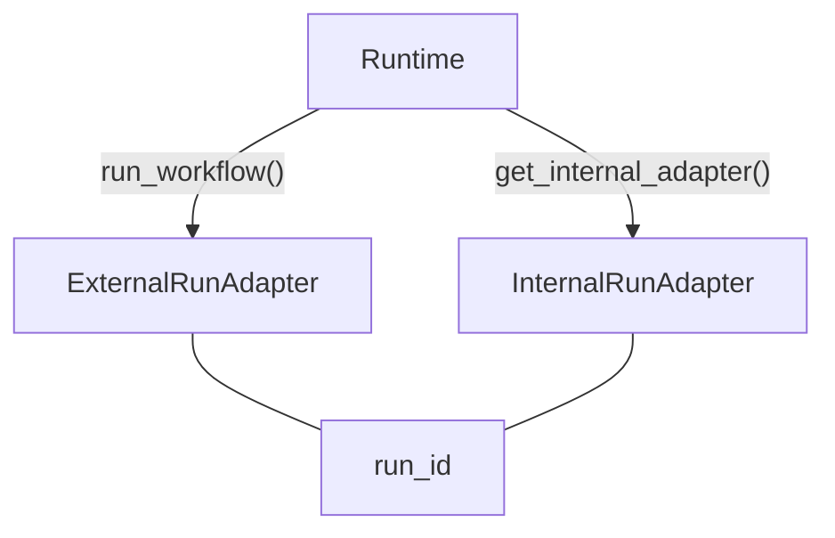
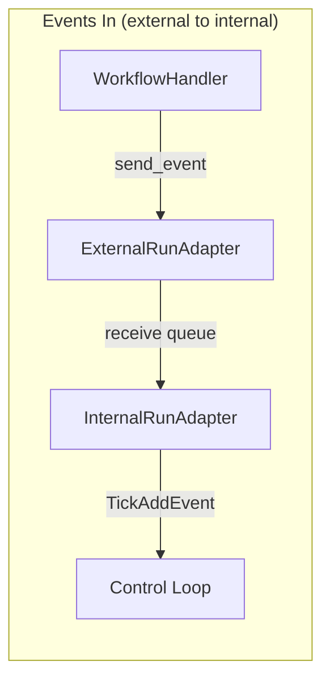
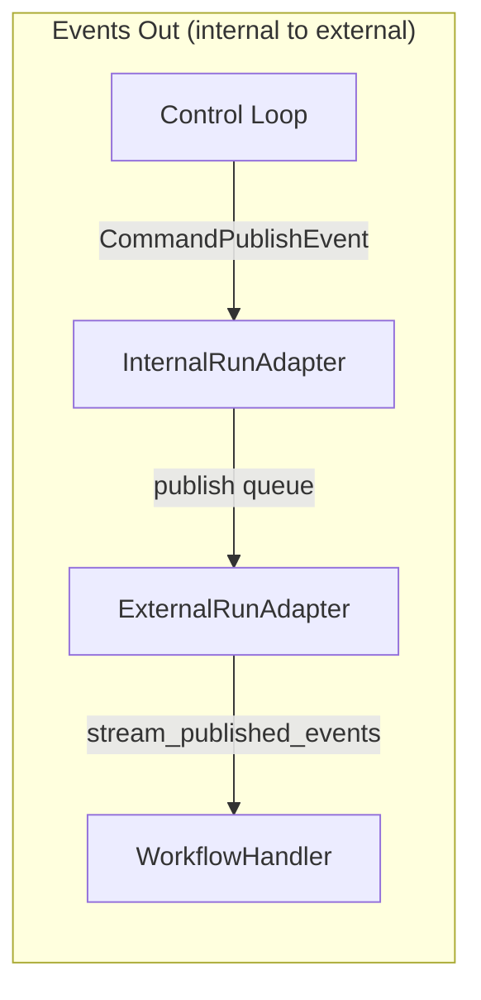

# Core Architecture: Workflow, Context, and Runtime

## Overview

The system has three zones. **Client** code calls `Workflow.run()` and interacts through `WorkflowHandler` and `Context`. The **Runtime** sits in the middle — the control loop drives execution, with `ExternalRunAdapter` and `InternalRunAdapter` as its boundaries. **Workers** are step functions that see `Context` with a different face (InternalContext).

The adapters are the key abstraction boundary. Everything on the client side goes through `ExternalRunAdapter`; everything on the worker side goes through `InternalRunAdapter`. The runtime is swappable by replacing or decorating these adapters.

## Workflow

Container for step definitions. A `WorkflowMeta` metaclass collects `@step`-decorated methods into `_step_functions`.

`run()` selects a runtime (explicit param > ContextVar > basic_runtime), validates steps, then delegates to `Context._workflow_run()`.

[`workflow.py`](../packages/llama-index-workflows/src/workflows/workflow.py)

## Context Faces

Context presents different interfaces depending on execution phase. Internally it holds a `_face` field that transitions through three types:

| Face | When | Used By | Key Operations |
|------|------|---------|----------------|
| PreContext | Before `run()` | Setup code | Configuration, serialization, state store init |
| ExternalContext | After `run()` | Handler / caller | `send_event()`, `stream_events()` |
| InternalContext | During step execution | Step functions | `collect_events()`, `wait_for_event()`, `write_event_to_stream()` |

Each face wraps an adapter from the runtime. Public methods on Context check the current face and raise `ContextStateError` if called in the wrong phase.

- [`context.py`](../packages/llama-index-workflows/src/workflows/context/context.py) — Context, `_face` field
- [`pre_context.py`](../packages/llama-index-workflows/src/workflows/context/pre_context.py) — PreContext
- [`external_context.py`](../packages/llama-index-workflows/src/workflows/context/external_context.py) — ExternalContext
- [`internal_context.py`](../packages/llama-index-workflows/src/workflows/context/internal_context.py) — InternalContext

## Runtime and Adapters

The `Runtime` ABC uses a dual-adapter pattern. Each workflow run produces two adapters sharing a `run_id`:

| Adapter | Used By | Key Methods |
|---------|---------|-------------|
| InternalRunAdapter | Control loop | `wait_receive()`, `on_tick()`, `wait_for_next_task()`, `get_now()` |
| ExternalRunAdapter | WorkflowHandler | `send_event()`, `stream_published_events()`, `get_result()`, `cancel()` |

Runtimes are composable via decorators — see [server-architecture.md](./server-architecture.md#runtime-decorator-chain) for the decorator chain pattern.

[`plugin.py`](../packages/llama-index-workflows/src/workflows/runtime/types/plugin.py) — Runtime ABC, InternalRunAdapter, ExternalRunAdapter

## Control Loop

The control loop is the core execution engine. It follows a reducer pattern where pure state transitions produce side effects as commands. The control loop is runtime-agnostic — it interacts with the outside world exclusively through `InternalRunAdapter`.

See [control-loop.md](./control-loop.md) for the full architecture.

## Event Flow

## WorkflowHandler

Returned by `Workflow.run()`. The user-facing handle for a running workflow.

- `await handler` — blocks until StopEvent, returns the result
- `handler.stream_events()` — async iterator of published events (single consumption)
- `handler.send_event()` — send events into the running workflow
- `handler.cancel_run()` — graceful cancellation

[`handler.py`](../packages/llama-index-workflows/src/workflows/handler.py)
