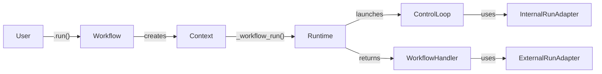
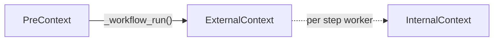
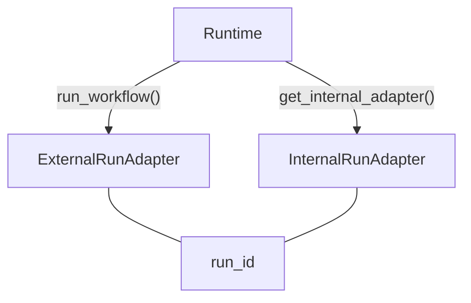

# Core Architecture: Workflow, Context, and Runtime

## Overview



A **Workflow** is a container for step functions. Calling `run()` creates a **Context**, which asks the **Runtime** to launch execution. The runtime returns two adapters — one for the **control loop** (internal) and one for the caller via **WorkflowHandler** (external).

## Workflow

Container for step definitions. A `WorkflowMeta` metaclass collects `@step`-decorated methods into `_step_functions`.

`run()` selects a runtime (explicit param > ContextVar > basic_runtime), validates steps, then delegates to `Context._workflow_run()`.

- [`workflow.py:47`](../packages/llama-index-workflows/src/workflows/workflow.py#L47) — WorkflowMeta
- [`workflow.py:379`](../packages/llama-index-workflows/src/workflows/workflow.py#L379) — `run()`

## Context Faces

Context presents different interfaces depending on execution phase. Internally it holds a `_face` field that transitions through three types:



| Face | When | Used By | Key Operations |
|------|------|---------|----------------|
| PreContext | Before `run()` | Setup code | Configuration, serialization, state store init |
| ExternalContext | After `run()` | Handler / caller | `send_event()`, `stream_events()` |
| InternalContext | During step execution | Step functions | `collect_events()`, `wait_for_event()`, `write_event_to_stream()` |

Each face wraps an adapter from the runtime. Public methods on Context check the current face and raise `ContextStateError` if called in the wrong phase.

- [`context.py:129`](../packages/llama-index-workflows/src/workflows/context/context.py#L129) — `_face` field
- [`pre_context.py:23`](../packages/llama-index-workflows/src/workflows/context/pre_context.py#L23) — PreContext
- [`external_context.py:33`](../packages/llama-index-workflows/src/workflows/context/external_context.py#L33) — ExternalContext
- [`internal_context.py:34`](../packages/llama-index-workflows/src/workflows/context/internal_context.py#L34) — InternalContext

## Runtime and Adapters

The `Runtime` ABC uses a dual-adapter pattern. Each workflow run produces two adapters sharing a `run_id`:



| Adapter | Used By | Key Methods |
|---------|---------|-------------|
| InternalRunAdapter | Control loop | `wait_receive()`, `on_tick()`, `wait_for_next_task()`, `get_now()` |
| ExternalRunAdapter | WorkflowHandler | `send_event()`, `stream_published_events()`, `get_result()`, `cancel()` |

Runtimes are composable via decorators — see the server architecture doc for the decorator chain pattern.

- [`plugin.py:391`](../packages/llama-index-workflows/src/workflows/runtime/types/plugin.py#L391) — Runtime ABC
- [`plugin.py:70`](../packages/llama-index-workflows/src/workflows/runtime/types/plugin.py#L70) — InternalRunAdapter
- [`plugin.py:236`](../packages/llama-index-workflows/src/workflows/runtime/types/plugin.py#L236) — ExternalRunAdapter

## Control Loop

The control loop follows a reducer pattern:

```
State + Tick --> (NewState, list[Command])
```

`_reduce_tick()` dispatches on tick type:

| Tick | Purpose |
|------|---------|
| TickAddEvent | Route event to accepting steps, check capacity, queue overflow |
| TickStepResult | Handle step completion — StopEvent, retry, re-run on snapshot mismatch |
| TickCancelRun | Graceful cancellation |
| TickPublishEvent | Publish to external event stream |
| TickTimeout | Workflow-level timeout |

Commands emitted by reducers execute sequentially: `CommandQueueEvent`, `CommandRunWorker`, `CommandCompleteRun`, `CommandHalt`, `CommandPublishEvent`, `CommandFailWorkflow`.

Scheduling uses two sources: a synchronous tick buffer (drained each iteration) and a min-heap of scheduled wakeups for delays/timeouts.

- [`control_loop.py:272`](../packages/llama-index-workflows/src/workflows/runtime/control_loop.py#L272) — `_ControlLoopRunner.run()`
- [`control_loop.py:490`](../packages/llama-index-workflows/src/workflows/runtime/control_loop.py#L490) — `_reduce_tick()`

## Event Flow

Events into the workflow (external to internal):

```
handler.send_event()
  --> ctx.send_event()
    --> ExternalRunAdapter.send_event()
      --> receive_queue
        --> control_loop via InternalRunAdapter.wait_receive()
          --> _reduce_tick(TickAddEvent)
```

Events out of the workflow (internal to external):

```
ctx.write_event_to_stream()
  --> InternalRunAdapter.write_to_event_stream()
    --> publish_queue
      --> ExternalRunAdapter.stream_published_events()
        --> handler.stream_events()
```

## WorkflowHandler

Returned by `Workflow.run()`. The user-facing handle for a running workflow.

- `await handler` — blocks until StopEvent, returns the result
- `handler.stream_events()` — async iterator of published events (single consumption)
- `handler.send_event()` — send events into the running workflow
- `handler.cancel_run()` — graceful cancellation

[`handler.py:26`](../packages/llama-index-workflows/src/workflows/handler.py#L26) — WorkflowHandler
