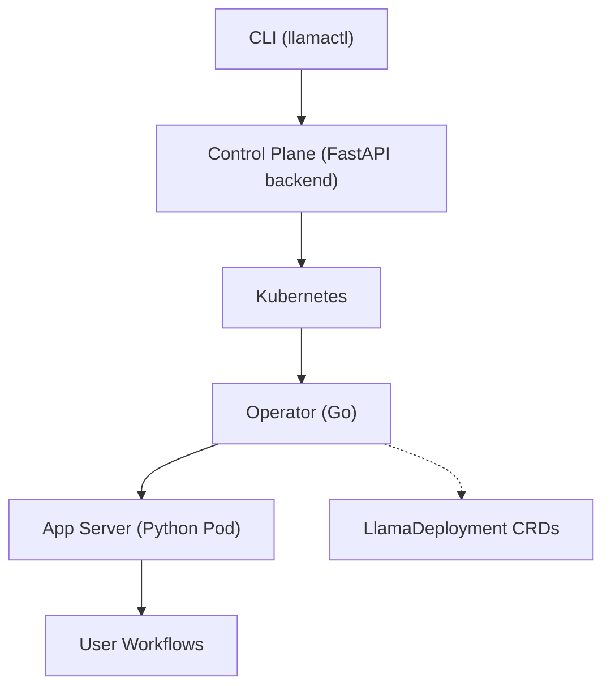
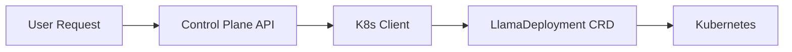
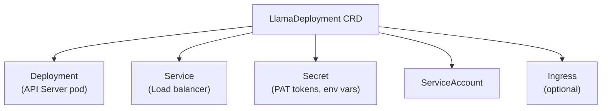
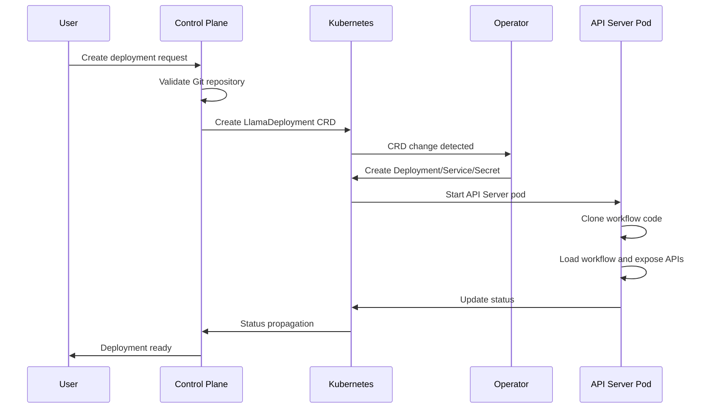

# Cloud Llama Deploy - Overall Architecture

This document outlines the architecture of the Cloud Llama Deploy system, which enables deployment and management of LlamaIndex workflows on Kubernetes.

## High-Level System Overview

The system consists of several interconnected components that work together to provide a complete deployment platform:



## Component Details

### 1. Core Package (`llama-deploy-core`)
**Purpose**: Shared data models and schemas used across all components.

**Role**: Ensures consistent data structures across the entire system.

### 2. Control Plane (`llama-deploy-control-plane`)
**Purpose**: Main orchestration layer that manages deployments via Kubernetes.

**Components**:
- **K8s Client** (`k8s_client.py`): Interfaces with Kubernetes API to create/manage LlamaDeployment CRDs
- **Git Integration**: Clones repositories, validates Git refs, handles GitHub authentication
- **API Endpoints**: REST API for deployment and project management

**Flow**:


### 3. Kubernetes Operator (`operator/`)
**Purpose**: Kubernetes controller that reconciles LlamaDeployment custom resources.

**Key Components**:
- **CRD Definition**: `LlamaDeployment` custom resource with spec (repo URL, deployment file, git ref)
- **Controller**: Watches for LlamaDeployment changes and creates/updates Kubernetes resources
- **Reconciliation Loop**: Creates deployments, services, secrets, and ingresses

**Managed Resources**:


**Phases**: `Syncing` → `Pending` → `Running` / `Failed` / `RollingOut`

### 4. App Server (`appserver`)
**Purpose**: Runtime environment that executes user workflows and provides APIs.

**Key Components**:
- **Deployment Manager**: Loads and manages workflow deployments from config
- **Workflow Execution**: Runs LlamaIndex workflows with session management
- **Source Managers**: Handle Git, local, and Docker sources for workflow code
- **API Endpoints**: REST and WebSocket APIs for interacting with workflows

**Configuration**:
- **Primary**: Embedded in `pyproject.toml` under `[tool.llamadeploy]`
- **Alternative**: `llama_deploy.toml` or `llama_deploy.yaml` with the same schema

Example (TOML in `pyproject.toml`):
```toml
[tool.llamadeploy]
name = "my-deployment"
app = "path.to.module:app"

[tool.llamadeploy.ui]
directory = "./ui"
```

### 5. CLI Tool (`llamactl`)
**Purpose**: Command-line interface for users to interact with the control plane.
```bash
llamactl auth env switch https://api.cloud.llamaindex.ai
llamactl auth login
llamactl auth token
llamactl auth logout
llamactl deployment create
llamactl deployment list
llamactl deployment get <id>
```

## Component Interaction Flow

### Deployment Creation Flow


### Data Flow
**Configuration**: Git Repo → Control Plane → LlamaDeployment CRD → Operator → API Server Pod
**Runtime**: User Request → API Server → Workflow Engine → Response
**Monitoring**: API Server → Prometheus Metrics | Operator → K8s Events → Status Updates

## Networking & Communication

- **External Access**: Ingress → Service → API Server Pod
- **Internal K8s**: Operator talks to K8s API server
- **Control Plane**: Communicates with K8s via client libraries
- **CLI**: HTTP calls to Control Plane API
- **Workflow APIs**: Direct HTTP/WebSocket to API Server pods

## Namespace Layout

Set `apps.namespace` to run the control plane + operator in the release
namespace and put `LlamaDeployment` CRs and their child resources (Deployments,
Pods, Services, Secrets, ServiceAccounts, ConfigMaps, Ingresses, NetworkPolicies,
build Jobs) in a separate namespace. Unset = everything in the release namespace.

CRs stay co-located with their children (cross-namespace owner references are
not allowed). Only `WATCH_NAMESPACE` (operator) and `KUBERNETES_NAMESPACE`
(control plane) point at the apps namespace; reconciler code is unchanged.

RBAC in split mode: apps-namespace Role with every rule except
`coordination.k8s.io/leases`, release-namespace Role with just that rule for
leader election. Unset collapses to one Role.

`imagePullSecrets` are not mirrored — provision them in the apps namespace, or
use node-level pull credentials.
