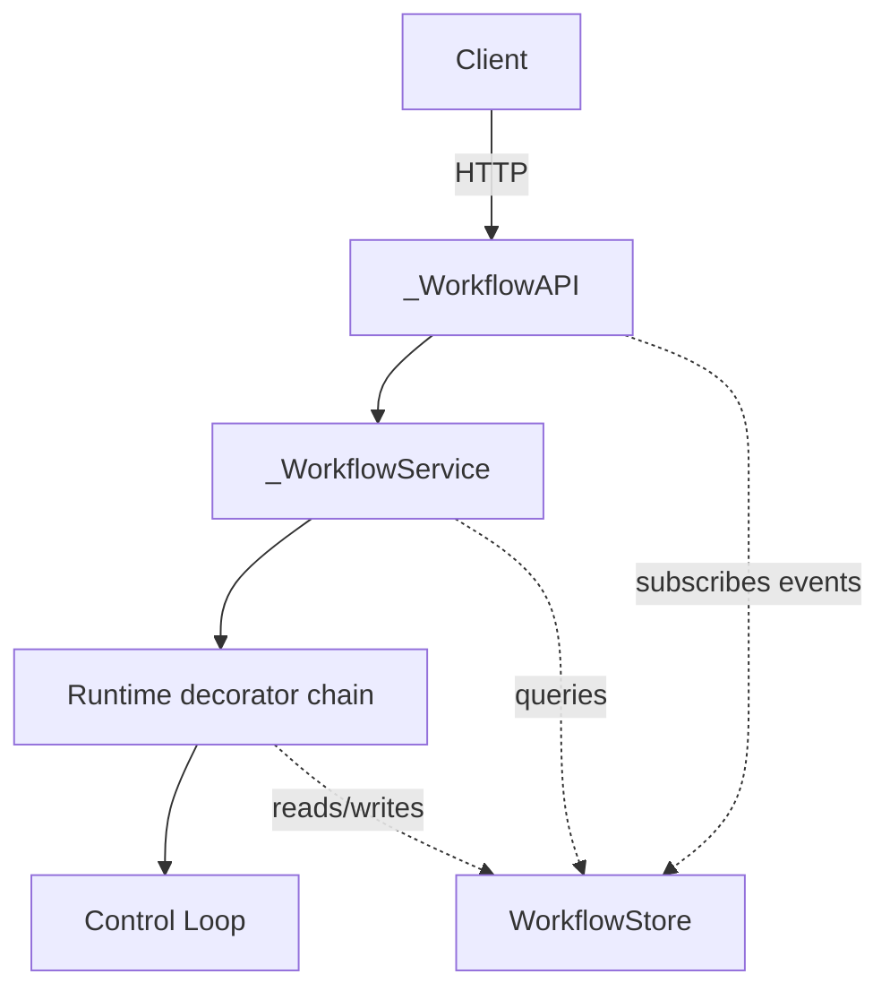
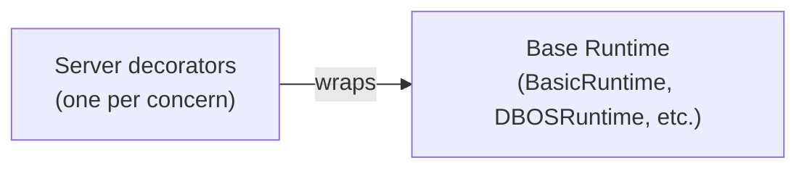
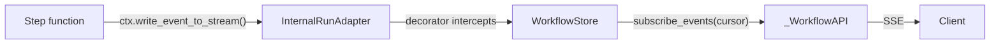

# Server Architecture

## Overview

The server wraps the core workflow engine (see [core-overview.md](./core-overview.md)) with HTTP access, persistence, and durability. Components are layered with clear boundaries:

The **store** is the shared persistence layer — the runtime writes to it, the service queries it, and the API streams from it.

## Components

**`WorkflowServer`** — Entry point. Assembles the runtime chain, service, and API into a Starlette app. Registers workflows.
[`server.py`](../packages/llama-agents-server/src/llama_agents/server/server.py)

**`_WorkflowAPI`** — Starlette routes. Translates HTTP requests into service calls and streams events from the store to clients via SSE.
[`_api.py`](../packages/llama-agents-server/src/llama_agents/server/_api.py)

**`_WorkflowService`** — Application logic. Starts workflows, manages handler lifecycle, coordinates event sending and cancellation. Bridges the API to the runtime.
[`_service.py`](../packages/llama-agents-server/src/llama_agents/server/_service.py)

**Runtime decorators** — A chain of decorators that add server concerns (event recording, tick persistence, idle release, etc.) on top of a base runtime. See the section below.
[`_runtime/`](../packages/llama-agents-server/src/llama_agents/server/_runtime/) — standard server decorators

**`AbstractWorkflowStore`** — Persistence contract shared by all layers above.
[`abstract_workflow_store.py`](../packages/llama-agents-server/src/llama_agents/server/_store/abstract_workflow_store.py)

## Runtime Decorator Chain

Runtimes compose via decoration. Each decorator wraps a `Runtime` and its adapters (see [core-overview.md — Runtime and Adapters](./core-overview.md#runtime-and-adapters)), overriding only the methods it needs to add a specific concern — event recording to a store, tick persistence for replay, idle detection and memory release, etc.

`WorkflowServer` assembles a default decorator chain on top of whatever base runtime is provided. The base runtime is swappable — pass `runtime=` to `WorkflowServer` to use a different one (BasicRuntime, DBOSRuntime, or a custom implementation). See `server.py` for how the default chain is assembled.

**Writing a decorator:** Extend `BaseRuntimeDecorator` and optionally `BaseInternalRunAdapterDecorator` / `BaseExternalRunAdapterDecorator`. These forward all methods to the inner runtime/adapter — override only what you need.
[`runtime_decorators.py`](../packages/llama-agents-server/src/llama_agents/server/_runtime/runtime_decorators.py)

## Persistence (WorkflowStore)

The store is the system's source of truth for anything that survives a restart or an idle-release cycle. All layers depend on it:

| What's stored | Purpose |
|---|---|
| Handler records | Lifecycle tracking (status, timestamps, result) |
| Event log | Resumable event streaming to clients |
| Ticks | Rebuild workflow state after idle release or restart |
| State stores | Persistent key-value state per run |

Two implementations:
- **`MemoryWorkflowStore`** — In-process dicts. No persistence across restarts.
  [`memory_workflow_store.py`](../packages/llama-agents-server/src/llama_agents/server/_store/memory_workflow_store.py)
- **`SqliteWorkflowStore`** — SQLite-backed. Survives restarts.
  [`sqlite_workflow_store.py`](../packages/llama-agents-server/src/llama_agents/server/_store/sqlite/sqlite_workflow_store.py)

## Resumable Event Streams

Events flow from step functions to clients through the store, which acts as both a write-ahead log and a subscription source:

The store assigns each event a monotonic **sequence number**. Clients track their position via this cursor:

1. Client connects, receives events as SSE with `id: {sequence}`
2. Client disconnects (network drop, restart, etc.)
3. Client reconnects with `Last-Event-ID: {last_seen_sequence}`
4. Store replays all events after that sequence, then continues live

This means the API layer never needs to hold event history in memory — it just opens a `subscribe_events(after_sequence=cursor)` iterator from the store each time a client connects.

A special `"now"` cursor skips all historical events and streams only new ones.

## Server Lifecycle

**Start:** `WorkflowServer.start()` queries the store for handlers with `status=running` that aren't idle, and resumes each by rebuilding context from stored ticks.

**Stop:** `WorkflowServer.stop()` aborts all active control loops. Handler records remain in the store — they'll resume on next start.

**Idle release:** When the [control loop detects](./control-loop.md#key-design-decisions) all steps are waiting on external input, it publishes `WorkflowIdleEvent`. Runtime decorators can use this signal to release the workflow from memory. When a new event arrives for that workflow, it reloads from ticks transparently.
