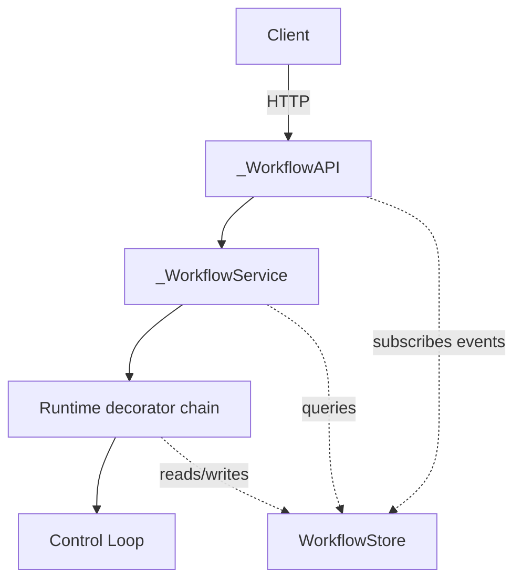
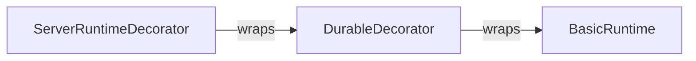
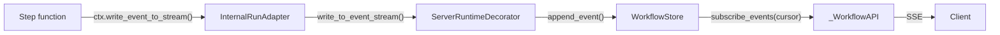

# Server Architecture

## Overview

The server wraps the core workflow engine (see [core-overview.md](./core-overview.md)) with HTTP access, persistence, and durability. Components are layered with clear boundaries:



The **store** is the shared persistence layer — the runtime writes to it, the service queries it, and the API streams from it.

## Components

**`WorkflowServer`** — Entry point. Assembles the runtime chain, service, and API into a Starlette app. Registers workflows.
[`server.py`](../packages/llama-agents-server/src/llama_agents/server/server.py)

**`_WorkflowAPI`** — Starlette routes. Translates HTTP requests into service calls and streams events from the store to clients via SSE.
[`_api.py`](../packages/llama-agents-server/src/llama_agents/server/_api.py)

**`_WorkflowService`** — Application logic. Starts workflows, manages handler lifecycle, coordinates event sending and cancellation. Bridges the API to the runtime.
[`_service.py`](../packages/llama-agents-server/src/llama_agents/server/_service.py)

**`ServerRuntimeDecorator`** — Runtime decorator. Records every published event to the store and tracks handler status (running → completed/failed/cancelled).
[`server_runtime.py`](../packages/llama-agents-server/src/llama_agents/server/_runtime/server_runtime.py)

**`DurableDecorator`** — Runtime decorator. Persists ticks for state reconstruction. Releases idle workflows from memory and reloads them on demand when new events arrive.
[`durable_runtime.py`](../packages/llama-agents-server/src/llama_agents/server/_runtime/durable_runtime.py)

**`AbstractWorkflowStore`** — Persistence contract shared by all layers above.
[`abstract_workflow_store.py`](../packages/llama-agents-server/src/llama_agents/server/_store/abstract_workflow_store.py)

## Runtime Decorator Chain

Runtimes compose via decoration. Each decorator wraps a `Runtime` and its adapters (see [core-overview.md — Runtime and Adapters](./core-overview.md#runtime-and-adapters)), overriding only the methods it needs:



`WorkflowServer` assembles this by default:

```python
inner = DurableDecorator(basic_runtime, store=store)
runtime = ServerRuntimeDecorator(inner, store=store)
```

**What's swappable:** The inner runtime. Pass `runtime=` to `WorkflowServer` to replace `DurableDecorator(basic_runtime)` with anything — a custom runtime, a differently-configured durable stack, etc. `ServerRuntimeDecorator` always wraps the outermost layer.

**Writing a decorator:** Extend `BaseRuntimeDecorator` and optionally `BaseInternalRunAdapterDecorator` / `BaseExternalRunAdapterDecorator`. These forward all methods to `self._inner` — override only what you need.
[`runtime_decorators.py`](../packages/llama-agents-server/src/llama_agents/server/_runtime/runtime_decorators.py)

### What each decorator adds

**ServerRuntimeDecorator** intercepts `InternalRunAdapter.write_to_event_stream()`:
- Serializes every published event and appends it to the store's event log
- Detects terminal events (`StopEvent`, `WorkflowFailedEvent`, etc.) and updates the handler's status

**DurableDecorator** intercepts both adapters:
- `InternalRunAdapter.on_tick()` — persists every control loop tick to the store
- `InternalRunAdapter.write_to_event_stream()` — detects `WorkflowIdleEvent`, schedules memory release
- `ExternalRunAdapter.send_event()` — if the workflow was released, reloads it from stored ticks before delivering the event

## Persistence (WorkflowStore)

The store is the system's source of truth for anything that survives a restart or an idle-release cycle. All layers depend on it:

| What's stored | Written by | Read by | Purpose |
|---|---|---|---|
| Handler records | ServerRuntimeDecorator | Service, API | Lifecycle tracking (status, timestamps, result) |
| Event log | ServerRuntimeDecorator | API (stream), Store (subscribe) | Resumable event streaming to clients |
| Ticks | DurableDecorator | DurableDecorator | Rebuild workflow state after idle release or restart |
| State stores | DurableDecorator | Workflow steps | Persistent key-value state per run |

Two implementations:
- **`MemoryWorkflowStore`** — In-process dicts + `asyncio.Condition` for live subscriptions. No persistence across restarts.
  [`memory_workflow_store.py`](../packages/llama-agents-server/src/llama_agents/server/_store/memory_workflow_store.py)
- **`SqliteWorkflowStore`** — SQLite-backed. Survives restarts. Condition + polling hybrid for subscriptions.
  [`sqlite_workflow_store.py`](../packages/llama-agents-server/src/llama_agents/server/_store/sqlite/sqlite_workflow_store.py)

## Resumable Event Streams

Events flow from step functions to clients through the store, which acts as both a write-ahead log and a subscription source:



The store assigns each event a monotonic **sequence number**. Clients track their position via this cursor:

1. Client connects, receives events as SSE with `id: {sequence}`
2. Client disconnects (network drop, restart, etc.)
3. Client reconnects with `Last-Event-ID: {last_seen_sequence}`
4. Store replays all events after that sequence, then continues live

This means the API layer never needs to hold event history in memory — it just opens a `subscribe_events(after_sequence=cursor)` iterator from the store each time a client connects.

A special `"now"` cursor skips all historical events and streams only new ones.

## Server Lifecycle

**Start:** `WorkflowServer.start()` → `DurableDecorator.launch()` queries the store for handlers with `status=running, is_idle=False` and resumes each by rebuilding context from stored ticks and calling `workflow.run()`.

**Stop:** `WorkflowServer.stop()` aborts all active control loops. Handler records remain in the store — they'll resume on next start.

**Idle release:** When the [control loop detects](./control-loop.md#key-design-decisions) all steps are waiting on external input, it publishes `WorkflowIdleEvent`. The DurableDecorator releases the workflow from memory. When a new event arrives for that workflow, it reloads from ticks transparently.
