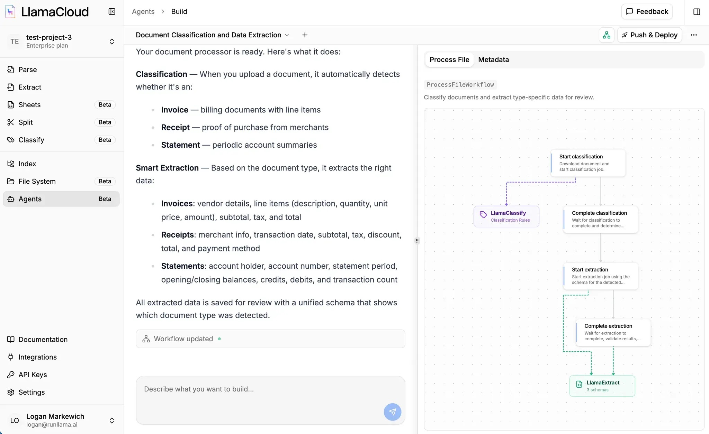

Agent Builder is a natural language interface for creating document workflows in LlamaCloud. Describe what you want to extract from your documents in plain English, and an AI coding agent generates a complete workflow you can deploy with a few clicks. The generated code is yours. It's a real Python project in your GitHub repository that you can customize, extend, or deploy on your own infrastructure.

## How It Works

Agent Builder transforms your descriptions into working document pipelines:

1. **Describe** your extraction needs in plain English
2. **Review** the generated workflow code and visual graph
3. **Deploy** to LlamaCloud, or take the code and run it on your own infrastructure

The agent understands LlamaCloud services and can configure extraction schemas, classification rules, and multi-step pipelines through conversation.

## Building Your First Workflow

### Start a New Session

From the LlamaCloud dashboard, navigate to **Agents** and click **Start Building**. This opens the chat interface where you'll describe your workflow.

### Describe What You Want

Tell the agent what documents you have and what data you want to extract. Be specific about your needs:

> "I have SEC 10-K filings and want to extract revenue, net income, and risk factors"

> "Extract line items, totals, and vendor information from invoices"

> "Given court documents, classify them as complaints, motions, or orders, then extract different fields based on type"

The agent will ask clarifying questions if it needs more detail about your requirements.

### Watch Your Workflow Take Shape

As the agent works, you'll see real-time activity showing files being created and modified, along with a visual graph of the pipeline steps. Once generation completes, you can continue chatting to refine it:

- Adjust the extraction schema to capture additional fields
- Add validation rules to check extracted data
- Change how documents are classified
- Modify any aspect of the workflow

For details on extraction schemas and configuration, see [LlamaExtract documentation](/python/cloud/llamaextract/getting_started).

:::tip[Experiment Freely]
Changes you make in the agent session don't automatically update an existing deployment. Your deployed workflow remains stable until you explicitly push the changes to GitHub and redeploy. This means you can experiment with different approaches, test new extraction fields, or iterate on your workflow without affecting production.
:::

## Deploying Your Workflow

When you're satisfied with your workflow, click **Deploy** to make it live. The deployment process connects your workflow to GitHub and deploys it to LlamaCloud.

:::note
Deployment requires a GitHub account. Your workflow code will be stored in a GitHub repository, enabling version control and future customization.
:::

### Step 1: Connect GitHub

Click **Connect GitHub** to authorize LlamaCloud to access your GitHub account. This uses standard GitHub OAuth and allows LlamaCloud to create repositories on your behalf.

### Step 2: Create or Select a Repository

Choose where to store your workflow code:

- **Create new repository**: LlamaCloud creates a new repo in your account with your workflow code
- **Select existing**: Choose an existing repository (useful for updates or adding to an existing project)

### Step 3: Install the LlamaCloud GitHub App

:::info
This is a separate step from GitHub user authentication. The GitHub App grants LlamaCloud's deployment infrastructure access to your organization or repository.
:::

You'll be prompted to install the **LlamaCloud GitHub App** on your repository. This grants LlamaCloud permission to:

- Read your repository contents
- Deploy updates when you push changes

**Why both OAuth and the GitHub App?** OAuth lets you authorize actions as yourself (like creating repositories). The GitHub App lets LlamaCloud's deployment infrastructure autonomously access your repo independently to build and deploy your workflow.

### Step 4: Configure and Deploy

Review the deployment configuration:

- **Environment variables**: Add any required API keys (e.g., `OPENAI_API_KEY` for LLM-powered steps)
- **Deployment name**: A unique identifier for this deployment

Click **Deploy**. LlamaCloud will build and deploy your workflow.

### Your Workflow is Live

Once deployment status shows **Running**, your workflow is ready to use:

- Click **Visit** to open the workflow's web interface
- Upload documents to process them through your pipeline
- View extracted data and results

## After Deployment

### Customizing Your Workflow Code

Your workflow is a real Python project using the open-source [Workflows](/python/llamaagents/workflows/index) framework. You can customize it beyond what the chat interface provides:

1. Clone the repository locally
2. Edit the workflow code directly
3. Push changes to GitHub
4. Update the deployment to pull your changes

For details on project structure, see [Configuration Reference](/python/llamaagents/llamactl/configuration-reference).

### Updating a Deployment

Deployments are intentionally decoupled from Agent Builder sessions. When you continue chatting with the agent and make changes, those changes are saved to your repository but **won't affect your running deployment** until you explicitly update it.

To deploy your latest changes:

1. Push your code changes to GitHub (either from Agent Builder or your local clone)
2. Go to your deployment in LlamaCloud
3. Click the **...** menu and select **Update Version**
4. LlamaCloud pulls and deploys your latest code

This separation lets you iterate and experiment in Agent Builder while keeping your production deployment stable.

### Managing Deployments

From the LlamaCloud dashboard, you can:

- **Rollback** to a previous version if something breaks
- **Edit settings** to change the repository or branch
- **Delete** deployments you no longer need

For full deployment management details, see [Click-to-Deploy](/python/llamaagents/llamactl/click-to-deploy).
