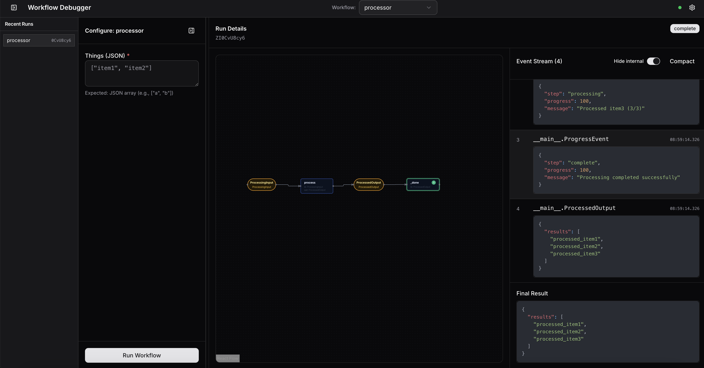

---
sidebar:
  order: 8
title: Drawing a Workflow
---

Workflows can be visualized, using the power of type annotations in your step definitions.

There are two main ways to visualize your workflows.

## 1. Converting a Workflow to HTML

First install:

```bash
pip install llama-index-utils-workflow
```

Then import and use:

```python
from llama_index.utils.workflow import (
    draw_all_possible_flows,
    draw_most_recent_execution,
)

# Draw all
draw_all_possible_flows(MyWorkflow, filename="all_paths.html")

# Draw an execution
w = MyWorkflow()
handler = w.run(topic="Pirates")
await handler
draw_most_recent_execution(handler, filename="most_recent.html")
```

## 2. Using the `workflow-debugger`

Workflows ship with a [`WorkflowServer`](/python/llamaagents/workflows/server/) that allows you to convert workflows to API's. As part of the `WorkflowServer`, a debugging UI is provided as the home `/` page.

Using this server app, you can visualize and run your workflows.



Setting up the server is straightforward:

```python
import asyncio
from workflows import Workflow, step
from workflows.events import StartEvent, StopEvent
from workflows.server import WorkflowServer

class MyWorkflow(Workflow):
    @step
    async def my_step(self, ev: StartEvent) -> StopEvent:
        return StopEvent(result="Done!")

async def main():
    server = WorkflowServer()
    server.add_workflow("my_workflow", MyWorkflow())
    await server.serve("0.0.0.0", "8080")

if __name__ == "__main__":
    asyncio.run(main())
```
